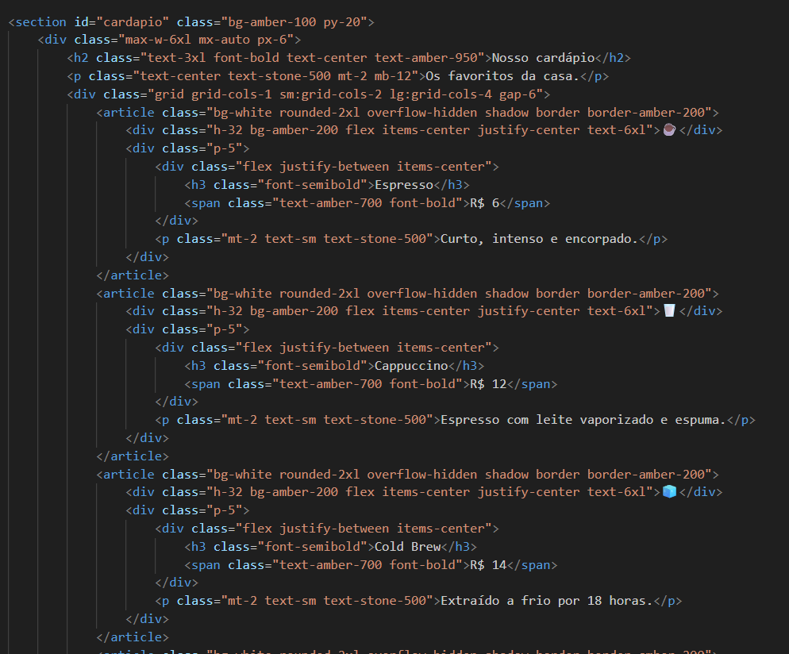
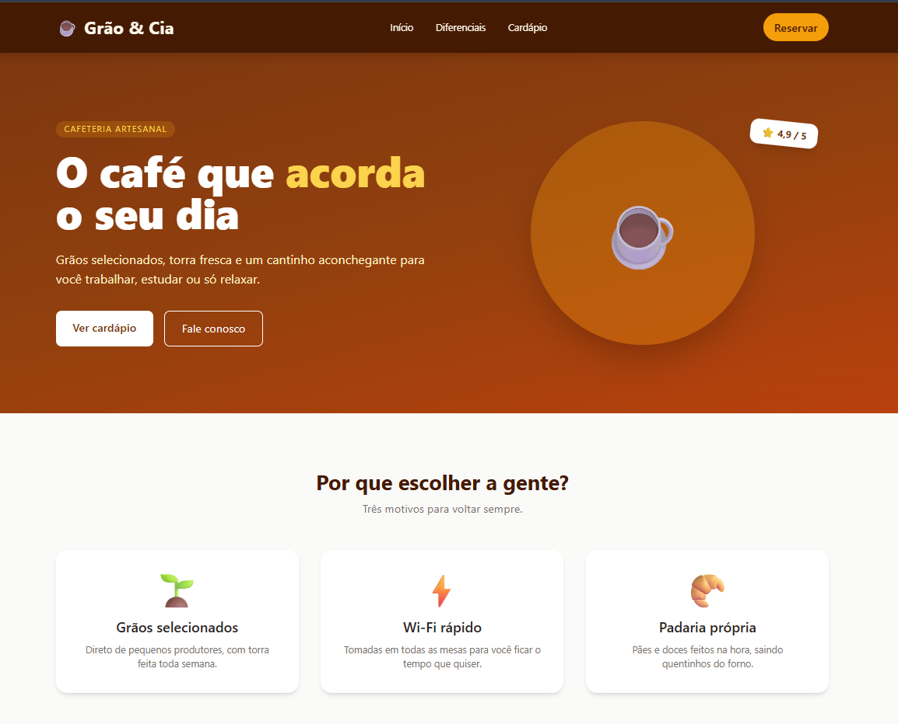

# Atividade 02 - Tailwind CSS

Landing page fictícia de uma cafeteria (**Grão & Cia**) feita com Tailwind CSS (via CDN). O projeto usa mais de 100 classes diferentes, bem acima das 30 pedidas.

**Link do projeto:** _(cole aqui o link do GitHub Pages ou do repositório)_

## Prints

### Código

### Aplicação em funcionamento

## Classes utilizadas

### Cores
| Classe | Função |
|---|---|
| `bg-stone-50` / `bg-white` / `bg-amber-100` / `bg-amber-200` | Fundos claros (página, cards, seção, imagem do card) |
| `bg-amber-500` / `bg-amber-950` / `bg-stone-900` | Fundos do botão, header/CTA e footer |
| `bg-amber-500/20` / `bg-amber-500/30` | Fundo âmbar com transparência |
| `bg-gradient-to-br` `from-amber-900` `via-amber-800` `to-orange-700` | Degradê diagonal do hero |
| `text-white` / `text-stone-800` / `text-stone-500` / `text-stone-400` | Cores de texto neutras |
| `text-amber-50` / `-100` / `-200` / `-300` / `-700` / `-900` / `-950` | Tons de âmbar no texto |
| `hover:bg-amber-400` / `hover:bg-amber-100` / `hover:bg-white/10` / `hover:text-amber-300` | Mudança de cor ao passar o mouse |

### Tipografia
| Classe | Função |
|---|---|
| `font-sans` | Fonte sem serifa |
| `font-semibold` / `font-bold` / `font-extrabold` | Pesos da fonte |
| `text-xs` / `text-sm` / `text-lg` / `text-xl` / `text-2xl` / `text-3xl` / `text-4xl` | Tamanhos de texto |
| `text-5xl` / `text-6xl` / `text-8xl` | Tamanhos grandes (emojis e título) |
| `md:text-6xl` | Título maior a partir de telas médias |
| `text-center` | Centraliza o texto |
| `uppercase` | Texto em maiúsculas |
| `tracking-wide` / `tracking-widest` | Espaçamento entre letras |
| `leading-tight` | Altura de linha reduzida |

### Espaçamentos
| Classe | Função |
|---|---|
| `p-5` / `p-8` | Padding em todos os lados |
| `px-3` / `px-4` / `px-6` / `px-8` | Padding horizontal |
| `py-1` / `py-2` / `py-3` / `py-4` / `py-6` / `py-16` / `py-20` / `py-24` | Padding vertical |
| `mx-auto` | Centraliza o bloco |
| `mb-4` / `mb-12` | Margem inferior |
| `mt-2` / `mt-3` / `mt-6` / `mt-8` | Margem superior |
| `gap-4` / `gap-6` / `gap-8` / `gap-10` | Espaço entre itens de flex/grid |

### Dimensões
| Classe | Função |
|---|---|
| `min-h-screen` | Altura mínima da tela |
| `max-w-6xl` | Largura máxima do conteúdo |
| `w-64` / `md:w-80` | Largura do círculo do hero |
| `h-64` / `md:h-80` / `h-32` | Alturas do círculo e da imagem dos cards |

### Bordas, sombras e efeitos
| Classe | Função |
|---|---|
| `border` / `border-2` | Espessura da borda |
| `border-amber-200` / `border-white` | Cor da borda |
| `rounded-lg` / `rounded-xl` / `rounded-2xl` / `rounded-full` | Cantos arredondados |
| `shadow` / `shadow-md` / `shadow-lg` / `shadow-2xl` / `hover:shadow-xl` | Sombras |
| `overflow-hidden` | Corta o conteúdo que passa das bordas |
| `rotate-6` | Gira o selo de avaliação |
| `hover:-translate-y-1` | Sobe o card ao passar o mouse |
| `transition` | Anima as mudanças de hover |

### Posicionamento
| Classe | Função |
|---|---|
| `sticky` / `top-0` / `z-50` | Header fixo no topo, acima do conteúdo |
| `relative` | Referência para o selo |
| `absolute` / `right-4` | Selo posicionado sobre o círculo |
| `inline-block` | Elemento em linha com padding/margem |
| `scroll-smooth` | Rolagem suave entre as seções |

### Flexbox
| Classe | Função |
|---|---|
| `flex` | Ativa o flexbox |
| `flex-col` / `sm:flex-row` | Coluna no mobile, linha a partir de `sm` |
| `items-center` | Alinha ao centro no eixo cruzado |
| `justify-between` / `justify-center` | Distribui ou centraliza no eixo principal |

### Grid
| Classe | Função |
|---|---|
| `grid` | Ativa o grid |
| `grid-cols-1` | 1 coluna no mobile |
| `sm:grid-cols-2` / `sm:grid-cols-3` | 2 ou 3 colunas a partir de `sm` |
| `md:grid-cols-2` | 2 colunas no hero a partir de `md` |
| `lg:grid-cols-4` | 4 colunas no cardápio a partir de `lg` |

### Responsividade
| Classe | Função |
|---|---|
| `hidden` + `md:flex` | Menu escondido no mobile e visível a partir de `md` |
| `sm:` `md:` `lg:` | Prefixos de breakpoint usados nas classes acima |
